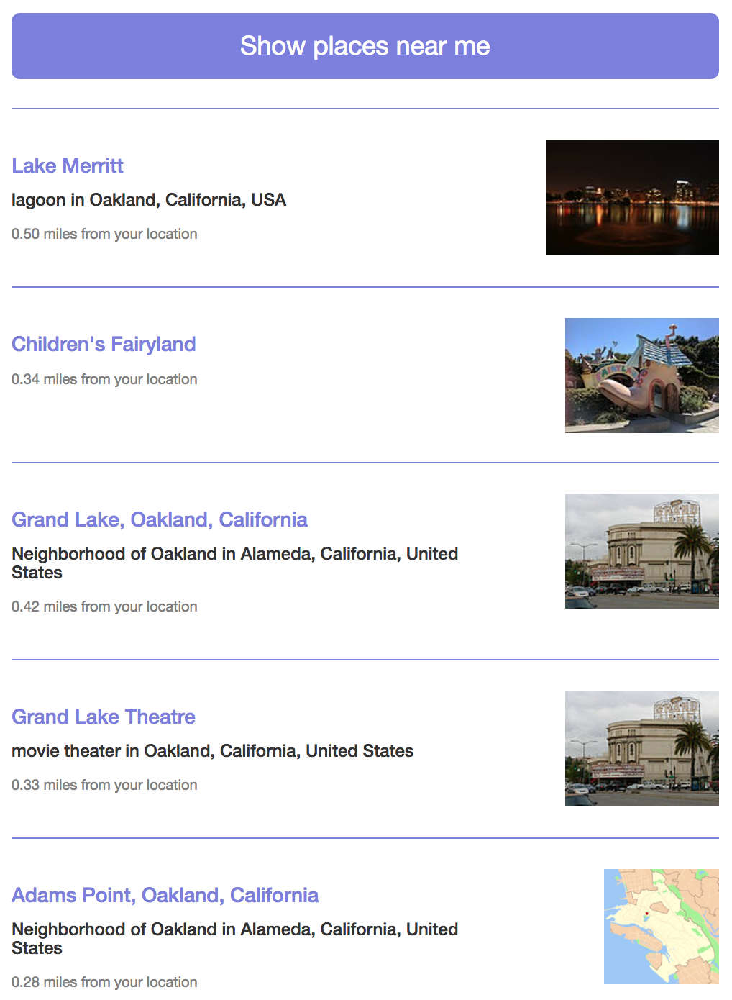

# NearMe-Demo
Geo search for wiki pages near your location using the [Geolocation API](https://developer.mozilla.org/en-US/docs/Web/API/Geolocation_API) and MediaWiki Action API's [Geosearch](https://www.mediawiki.org/wiki/API:Geosearch) module. View demo here https://codepen.io/srish/pen/YdrbaY.

Note: This repository is auto-generated via [Popcode](https://popcode.org/) environment, and the demo is part of a workshop planned for high-school students around Wikipedia APIs. 

Credits
=======
[Nearby](https://github.com/prtksxna/pebble-nearby), a Pebble app.

